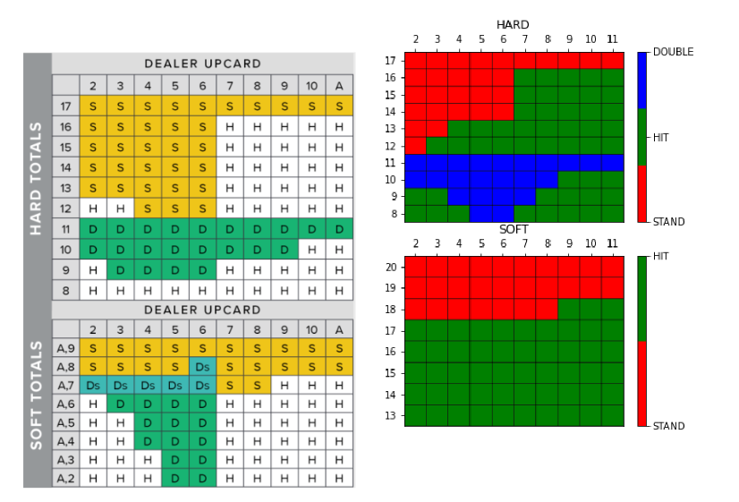

# Blackjack AI

An agent that learns to play blackjack using reinforcement learning.
The goal is to first have the agent play optimally with regard to basic perfect strategy,
and then examine other possible strategies.

Results after training the agent on 3,500,000 rounds of blackjack

Left: optimal moves. Right: results of the AI.
